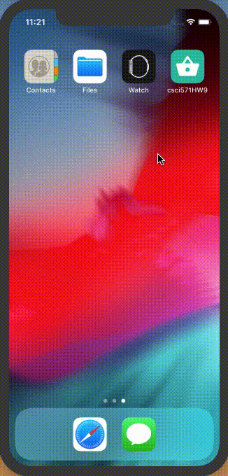
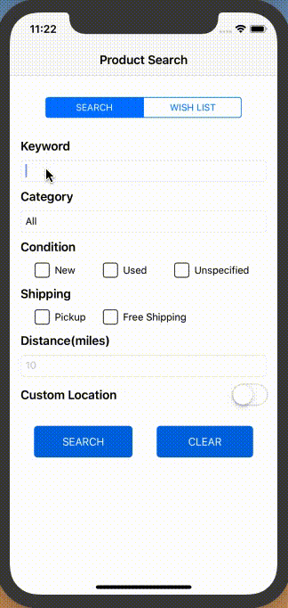

# Web Technologies Homework 9
Homework 9 for Web Technologies in Spring 2019
## Objective
* Become familiar with the Swift language, Xcode and iOS App development
* Practice the Model-View-Controller design pattern
* Build a good-looking iOS app
* Learn to integrate APIs and iOS SDK
* Manage and use third-party libraries by CocoaPods
* Get experience in AWS
## Decription
This homework is an iOS mobile app version of [Homework 8](https://github.com/LeonZAW/Web-HW8), which allows users to search for products using the *eBay APIs*, get product details, add products in wishlist, and post on Facebook.
## Preview
* App Launching

* Searching

* Item Details & Similar Items

* Starring Products & Facebook Posting

